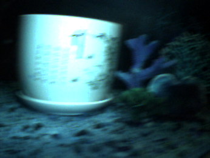
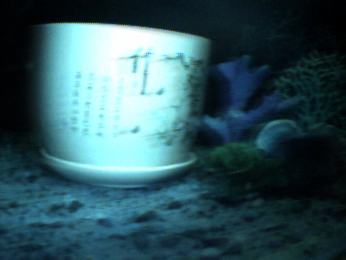

# Event-Guided Edge Reconstruction for Underwater Images

This repository contains a lightweight, modular image enhancement pipeline that uses event camera data to recover sharp edges in underwater RGB frames. Instead of traditional deblurring, we focus on **reconstructing lost structural information** using motion cues derived from asynchronous event streams. Our approach is interpretable, efficient, and independent of deep learning models.

---

## Overview

1. Extract RGB frames and event streams from underwater DAVIS recordings (.bag files).
2. Generate grayscale per-frame **event maps** to highlight regions with high temporal change.
3. Align and downsample the RGB and event data.
4. Apply event-guided Laplacian gradient injection to selectively restore edge information in blurry regions.

---

## Dataset

We used the **DAVIS-NUIUIED** dataset, presented in the paper:

> **"RGB/Event signal fusion framework for multi-degraded underwater image enhancement"**
> [ResearchGate Link](https://www.researchgate.net/publication/381024944_RGBEvent_signal_fusion_framework_for_multi-degraded_underwater_image_enhancement)

This dataset includes:

* Synchronized RGB and event streams from underwater scenes
* Captured using a DAVIS (Dynamic and Active-pixel Vision Sensor) camera
* Packaged as ROS bag files containing:

  * `/dvs/image_raw` — RGB image topic
  * `/dvs/events` — asynchronous event topic
  * `/dvs/imu` — IMU data (not used in this pipeline)

### How to Extract Data from `.bag` Files

We used the [`rosbags`](https://pypi.org/project/rosbags/) Python library for parsing ROS2 `.bag` files. Steps:

1. Install dependencies:

```bash
pip install rosbags
rosbags-convert scene_2.bag --dst converted_scene_2
```

2. Extract RGB frames:

```bash
python dump_frames.py  # Extracts /dvs/image_raw into PNGs in extracted_frames_scene_2/
```

3. Extract event stream:

```bash
python extract_events.py  # Dumps /dvs/events into dvs_events_scene_2.csv
```

4. Align timestamps and generate event maps:

```bash
python shift_event_timestamps.py  # Shifts event timestamps if YAML and CSV mismatch
python get_first_image_timestamp.py  # Gets the first RGB frame timestamp for alignment
python generate_event_maps.py  # Outputs aligned grayscale event maps into event_maps/
```

> Note: In our case, the timestamps in the YAML metadata and the event CSV did not initially align. To correct this, we used `shift_event_timestamps.py` in combination with `get_first_image_timestamp.py` to manually synchronize the data.

---

## Edge Reconstruction Pipeline Summary

After preprocessing, we enhance the RGB frames using a two-stage approach:

1. **Frame Fusion**: Combine three consecutive RGB frames (`t-1`, `t`, `t+1`) using either fixed or adaptive weighting based on the event map.
2. **Event-Guided Edge Injection**: Compute a Laplacian edge map and selectively inject it into regions with high event activity to recover sharp edges.

---

## Scripts

| Script                              | Description                                                |
| ----------------------------------- | ---------------------------------------------------------- |
| `dump_frames.py`                    | Extracts RGB frames from `/dvs/image_raw` topic            |
| `extract_events.py`                 | Extracts events from `/dvs/events` topic into CSV          |
| `generate_event_maps.py`            | Creates grayscale motion maps by integrating event data    |
| `shift_event_timestamps.py`         | Shifts timestamps to align event stream with RGB           |
| `get_first_image_timestamp.py`      | Retrieves timestamp of the first image in `/dvs/image_raw` |
| `event_guided_static_fusion.py`     | Applies static 3-frame average + event-based sharpening    |
| `event_weighted_temporal_fusion.py` | Applies event-weighted frame fusion + edge injection       |

---

## Directory Structure

> Note: Raw datasets and output folders are **not uploaded** due to size constraints.

```
/dataset.bag                       # Original DAVIS bag file
/extracted_frames_scene_2/        # RGB frames extracted from /dvs/image_raw
/event_maps/                      # Grayscale maps of event activity per RGB frame
/dvs_events_scene_2.csv           # Flattened DVS event log (x, y, timestamp, polarity)
/blended_deblurred_rgb/          # Final enhanced outputs (if applicable)
```

---

## Comparison of Methods

The repository contains two main enhancement scripts:

* `event_guided_static_fusion.py` computes a uniform average of the surrounding frames and applies event-guided Laplacian sharpening.
* `event_weighted_temporal_fusion.py` performs adaptive fusion of neighboring frames based on motion intensity derived from the event map. It better handles non-uniform blur and dynamically adjusts sharpening strength.

Both methods aim to restore structural detail by injecting motion-based edges, but differ in how they construct the RGB base image.

---

## Some Results

|                RGB Frame                |        Event-Guided Edge Reconstruction       |
| :-------------------------------------: | :-------------------------------------------: |
|  |  |

---

## Project Info

* **Course**: Computational Photography @ Hacettepe University
* **Author**: Leen Said
